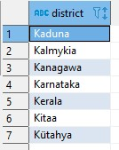
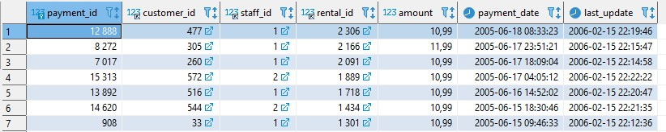
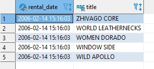
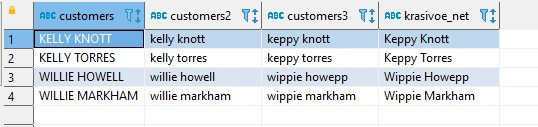
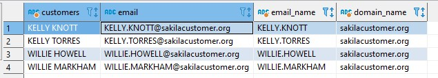
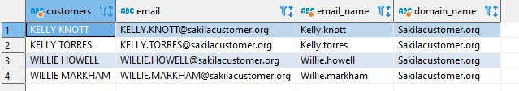

# Домашнее задание к занятию 12.3 "Реляционные базы данных: SQL. Часть 1" - Лабазов Александр

---

Задание можно выполнить как в любом IDE, так и в командной строке.

### Задание 1.

Получите уникальные названия районов из таблицы с адресами, которые начинаются на “K” и заканчиваются на “a”, и не содержат пробелов.
```SQL
SELECT 
	DISTINCT a.district
FROM 
	address a
WHERE 
	a.district LIKE 'K%a'
	AND 
	a.district NOT LIKE '% %'
ORDER BY a.district ASC;
```
Результат:


### Задание 2.

Получите из таблицы платежей за прокат фильмов информацию по платежам, которые выполнялись в промежуток с 15 июня 2005 года по 18 июня 2005 года **включительно**, 
и стоимость которых превышает 10.00.
```SQL
SELECT 
	*
FROM 
	payment p 
WHERE 
	p.payment_date BETWEEN '2005-06-15 00:00:00' AND '2005-06-18 23:59:59'
	AND 
	p.amount >10 
ORDER BY p.payment_date DESC;
```
Результат:


### Задание 3.

Получите последние 5 аренд фильмов.
```SQL
SELECT 
	r.rental_date,
	f.title 
FROM
	rental r 
LEFT JOIN inventory i ON i.inventory_id =r.inventory_id 
LEFT JOIN film f ON f.film_id =i.film_id 
ORDER BY r.rental_date DESC 
LIMIT 5;
```
Результат:


### Задание 4.

Одним запросом получите активных покупателей, имена которых Kelly или Willie. 

Сформируйте вывод в результат таким образом:
- все буквы в фамилии и имени из верхнего регистра переведите в нижний регистр,
- замените буквы 'll' в именах на 'pp'

```SQL
SELECT 
	CONCAT_WS(' ', c.first_name , c.last_name) customers,
	LOWER(CONCAT_WS(' ', c.first_name , c.last_name)) customers2,
	REPLACE(LOWER(CONCAT_WS(' ', c.first_name , c.last_name)),'ll','pp') customers3,
	REPLACE(
	CONCAT(UPPER(LEFT(c.first_name,1)),	LOWER(RIGHT(c.first_name,LENGTH(c.first_name)-1)), ' ',
		UPPER(LEFT(c.last_name,1)),	LOWER(RIGHT(c.last_name,LENGTH(c.last_name)-1))),
		'll','pp') krasivoe_net
FROM 
	customer c 
WHERE 
	LOWER(c.first_name) IN ('kelly','willie')
ORDER BY customers;
```
Результат:


## Дополнительные задания (со звездочкой*)
Эти задания дополнительные (не обязательные к выполнению) и никак не повлияют на получение вами зачета по этому домашнему заданию. Вы можете их выполнить, если хотите глубже и/или шире разобраться в материале.

### Задание 5*.

Выведите Email каждого покупателя, разделив значение Email на 2 отдельных колонки: в первой колонке должно быть значение, указанное до @, во второй значение, указанное после @.
```SQL
SELECT 
	CONCAT_WS(' ', c.first_name , c.last_name) customers,
	c.email email,
	LEFT(c.email,POSITION('@' IN c.email)-1) email_name,
	RIGHT(c.email,LENGTH(c.email)-POSITION('@' in c.email)) domain_name
FROM 
	customer c 
WHERE 
	LOWER(c.first_name) IN ('kelly','willie')
ORDER BY customers;
```
Результат:


### Задание 6.*

Доработайте запрос из предыдущего задания, скорректируйте значения в новых колонках: первая буква должна быть заглавной, остальные строчными.
```SQL
SELECT 
	CONCAT_WS(' ', c.first_name , c.last_name) customers,
	c.email email,
	CONCAT(
		UPPER(
			LEFT(
				LEFT(c.email,POSITION('@' IN c.email)-1), 1
			)
		),
		LOWER(
			RIGHT(
				LEFT(c.email,POSITION('@' IN c.email)-1),
				LENGTH(LEFT(c.email,POSITION('@' IN c.email)-1)) - 1
			)
		)
	) email_name,
	CONCAT(
		UPPER(
			LEFT(
				RIGHT(c.email,LENGTH(c.email)-POSITION('@' in c.email)), 1
			)
		),
		LOWER(
			RIGHT(
				RIGHT(c.email,LENGTH(c.email)-POSITION('@' in c.email)),
				LENGTH(RIGHT(c.email,LENGTH(c.email)-POSITION('@' in c.email))) - 1
			)
		) 
	) domain_name
FROM 
	customer c 
WHERE 
	LOWER(c.first_name) IN ('kelly','willie')
ORDER BY customers;
```
Результат:


